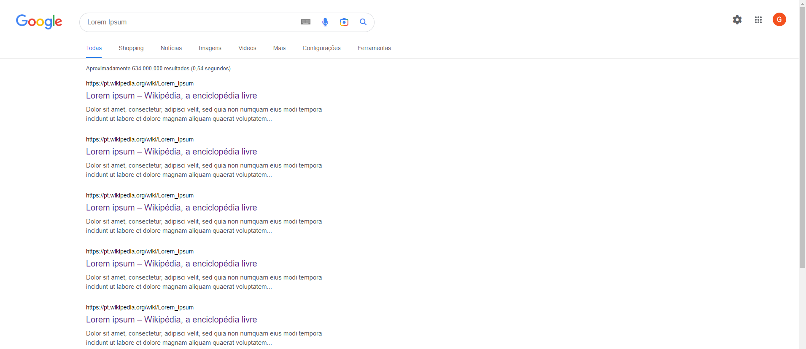

<h1 align="center">Projeto: Reconstrução dos Resultados Google</h1>

 

<kbd>

 

>Exercício

Projeto de reconstrução dos resultados do Google. 

[Clique aqui para acessar o site.](https://scgui.github.io/resultados-google/)

## 🔧 Tecnologias

- HTML
- CSS
- Git e Github

## Comentários

- Melhoria na percepção de tamanhos

## 🔌 Contato

guics37.go@gmail.com
